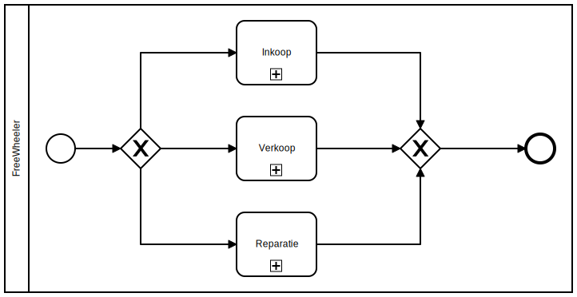

:toc: marco
:numbered:  1

= Visie/Scope

toc::[]

== Inleiding

**TODO:** __ inleidende text __ ...

== Organisatorische Context

**TODO:** __ beschrijving van de organisatie waarvoor de opdracht wordt uitgevoerd / de fietsenwinkel __.

== Aanleiding

**TODO:** __ Verhaal waarom de opdrachtgever een opdracht heeft uitgezet. Kernboodschap: In dit geval omdat er budget is om te automatiseren met als doel dat de automatisering zich terug moet verdienen. Echter door gebrek aan ICT kennis bij de opdrachtgever, is er ook een advies verzoek om te bepalen welk bedrijfsproces zich hiervoor het beste leent.__.

== Bedrijfsproces Analyse

Op basis van interview kunnen er een drietal processen bij de opdrachtgever onderkend worden. Te weten: Inkoop proces, Verkoop proces en Reparatie proces.

=== Inkoop proces

**TODO:** __Verhaal omtrent het inkoop proces; criteria voor- en tegen automatisering van dit proces opsommen.__

=== Verkoop proces

**TODO:** __Verhaal omtrent het verkoop proces; criteria voor- en tegen automatisering van dit proces opsommen.__

=== Reparatie proces
**TODO:** __Verhaal omtrent het reparatie proces; criteria voor- en tegen automatisering van dit proces opsommen.__

=== Conclusie
**TODO:** __ De voor en tegens van de drie processen tegen elkaar afwegen, waaruit zou moeten blijken dat het Reparatieproces het te adviseren proces is om te automatiseren.__

== Verdieping Rapartieproces
**TODO:** __Uitgebreidere beschrijving incl BPMN van het reparatieproces. Tabel met knelpunten die uit analyse van het proces voortkomen opstellen, en elk knelpunt nummeren (K#).__

image:./../assets/images/Reparatiekaart2.jpg[Voorkant Reparatiekaart, 450, 100]
image:./../assets/images/Reparatiekaart1.jpg[AchterkantReparatiekaart, 450, 100]

== Minimal Viable Products

**TODO:** __Inleiding van dit hoofdstuk schrijven. Dat dit hoofdstuk de visie zal beschrijven van het uiteindelijke product, waarvan het doel is om deze visie te behalen door in iteraties telkens MVP's op te leveren. In dit hoofdstuk wordt de scope van elke MVP aan de hand van User Stories vastgesteld.__.

=== MVP 1 - Heel Simple Reparatiekaart Systeem

**TODO:** __Algemeen verhaal omtrent de op te leveren applicatie van deze MVP.__

[%autowidth, options=header]
|===
| # User Story | User Story | Oplossing voor knelpunt
| #5 | Als medewerker wil ik een reparatiekaart digitaal kunnen aanmaken zodat deze fietsreparatie correct geregistreerd wordt/leesbaar opgeslagen wordt | __referentie naar Knelpunt nummer uit vorige hoofdstuk__ 
| #7 | Als medewerker wil ik een totaal overzicht kunnen inzien van alle reparaties zodat ik kan actuele informatie kan verkrijgen over reparaties | __referentie naar Knelpunt nummer uit vorige hoofdstuk__
|===

=== MVP 2 - Uitbreiden met klantenadministratie 

**TODO:** __Algemeen verhaal omtrent de op te leveren applicatie van deze MVP.__

[%autowidth, options=header]
|===
| # User Story | User Story | Oplossing voor knelpunt
| __(Github)Nummer van de User Story__ | __Als {rol} wil ik {functionaliteit}, zodat {doel}__ | __referentie naar Knelpunt nummer uit vorige hoofdstuk__ 
|===

=== MVP 3 - Verbeterde tijdinschatting

**TODO:** __Algemeen verhaal omtrent de op te leveren applicatie van deze MVP.__

[%autowidth, options=header]
|===
| # User Story | User Story | Oplossing voor knelpunt
| __(Github)Nummer van de User Story__ | __Als {rol} wil ik {functionaliteit}, zodat {doel}__ | __referentie naar Knelpunt nummer uit vorige hoofdstuk__ 
|===

...